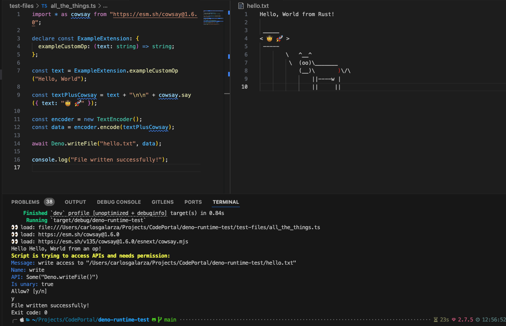

# Make your own JavaScript Runtime with Deno Runtime



This repo showcases how to create a JavaScript runtime using the Deno Runtime. This is useful for embedding and customizing Deno's runtime in your Rust application or creating a custom JavaScript runtime based on Deno's runtime. Deno Runtime has a permission model and architecture that makes it a great sandbox and you can write custom extensions and tap into their permissions. This repo showcases:
- Writing a custom extension
- Handling permissions with custom prompter
- Importing from https sources like esm.sh and handling TypeScript files

The `all_the_things.ts` file is a good one showcasing all three features: importing from https sources, handling permissions, and using extensions. You can find the implementation of everything in the `src/` directory on these three files:
- `main.rs` is the Rust code that bootstraps the runtime, defines the extension and handles the permissions.
- `bootstrap.js` is the entry point for the JavaScript side, here you sugar the extension code.
- `module_loader.rs` is the code that strips the TypeScript from the files so that they can be loaded as regular JavaScript files and imports from https sources and files.

I'll continue to add more features and examples as I need them for my projects. I hope this helps you too!

## Useful guides

These are useful guides that helped me undersand Deno's internals andhow to use the crates better:
- Deno's "Roll your own JavaScript runtime" series:
    - Part 1: https://deno.com/blog/roll-your-own-javascript-runtime
    - Part 2: https://deno.com/blog/roll-your-own-javascript-runtime-pt2
    - Part 3: https://deno.com/blog/roll-your-own-javascript-runtime-pt3
- Deno 2 internals by [Divy Srivastava](https://github.com/littledivy): https://littledivy.com/deno-2.html

## Run it!

You need to have Rust and Cargo installed: https://www.rust-lang.org/learn/get-started. Then run it with:

```bash
cargo run
```
